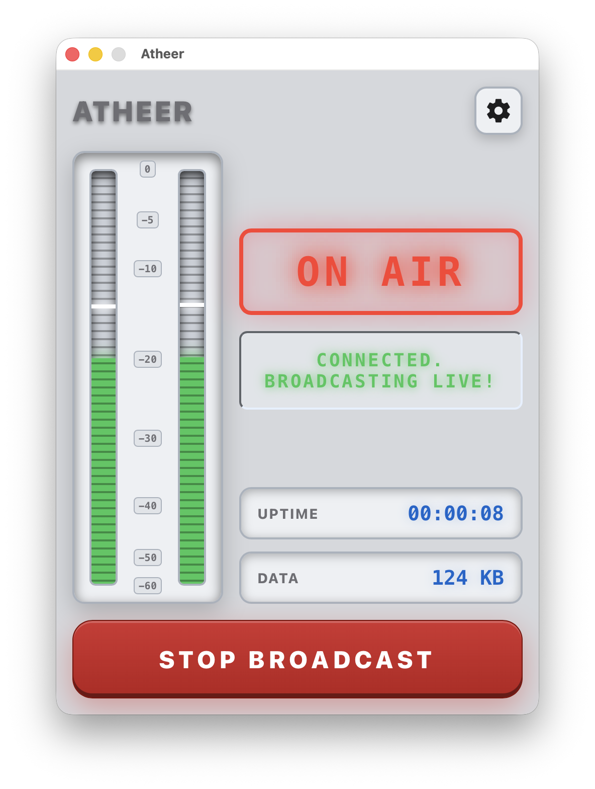

# Atheer

**Atheer** is a powerful, live audio broadcasting engine for Icecast, built with Go and Vue 3 using the [Wails](https://wails.io/) framework.

## What is Atheer?

The name **Atheer** originates from Arabic (أثير), meaning "Ether" or "the invisible medium through which radio waves travel". This perfectly captures the essence of the project: a reliable, seamless medium connecting your audio source to your listeners across the globe.

## Features

- **Robust Audio Engine:** A highly performant broadcasting engine written in Go.
- **Icecast Compatibility:** Seamlessly streams to Icecast servers.
- **Beautiful UI:** A stunning, dark-mode, hardware-style frontend designed with Vue 3, giving you the feel of professional broadcasting equipment.
- **Comprehensive Codec Support:** Statically links several industry-standard C libraries to handle diverse audio formats with zero runtime dependency headaches:
  - PortAudio
  - LAME
  - FDK-AAC
  - Opus
  - Ogg
  - Vorbis

## Building the Project

Atheer uses a `Makefile` to simplify building dependencies and the final application.

### macOS

1. Install and build dependencies:
   ```bash
   make deps-macos
   ```
   This command downloads and compiles all the required C libraries (PortAudio, LAME, FDK-AAC, etc.) statically for macOS.

2. Build the application:
   ```bash
   make build
   ```
   This will build the Wails application and generate the Atheer app binary for macOS.

### Linux

1. Install and build dependencies:
   ```bash
   make deps-linux
   ```
   This command installs the necessary system development packages and compiles the required static C libraries for Linux.

2. Build the application:
   ```bash
   make build-linux
   ```
   This will build the Wails application and generate the Atheer binary for Linux.

### Windows

Building for Windows is fully supported using Docker to cross-compile the static C-dependencies via MinGW-w64.

1. Build the Docker builder image:
   ```bash
   docker build -t atheer-windows-builder -f Dockerfile.windows-builder .
   ```

2. Run the build process inside the container:
   ```bash
   docker run --rm -v $(pwd):/app -w /app atheer-windows-builder /bin/bash -c "make deps-windows && make build-windows"
   ```

The resulting executable will be available at `build/bin/Atheer.exe`.

## Contributing

Contributions are always welcome! Since Atheer compiles with multiple C-dependencies, setting up the development environment might seem daunting, but it's fully automated:

1. Fork the project.
2. Run `make deps-macos` (or `make deps-linux`) to build the isolated static libraries natively on your machine.
3. Run `wails dev` to launch the live-reloading development server.
4. Submit a Pull Request with your feature or bug fix.

When contributing, please ensure your code follows the Go standard formatting (`go fmt`) and respects the existing Vue 3 architectural structure.

## License

Atheer is released under the [MIT License](LICENSE). 

Please note that compiling Atheer statically links multiple third-party libraries, including LAME (LGPL) and FDK-AAC (Fraunhofer). The MIT license applies to the Atheer application source code itself. Ensure you comply with the respective licenses of all statically linked dependencies if you decide to distribute compiled binaries.
